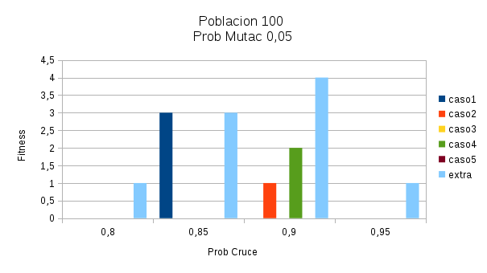
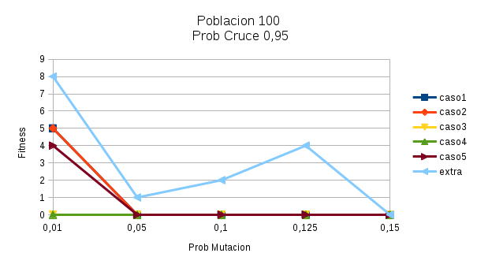

---
title: Sistemas Inteligentes
subtitle: Practica 1
author:
    - Pablo José Rocamora Zamora G3.2
date: 9 de Diciembre de 2017
header: dsad
footer: So is this
geometry: margin=1in
toc: true
toc-depth: 1
fontsize: 11pt # puede ser 10, 11 o 12
fontfamily: lmodern
documentclass: scrartcl
header-includes:
    - \usepackage{xcolor}
    - \definecolor{miverde}{rgb}{0.31,0.60,0.02}
    - \definecolor{migris}{rgb}{0.56,0.35,0.01}
    - \definecolor{mimazul}{rgb}{0.13,0.29,0.53}
    - \lstset{basicstyle=\small\ttfamily} # Fija el tamaño del tipo de letra utilizado para el código
    - \lstset{breaklines=true} # Activa el salto de línea automático
    - \lstset{extendedchars=true} # Permite utilizar caracteres extendidos no-ASCII; solo funciona para codificaciones de 8-bits; para UTF-8 no funciona. En xelatex necesita estar a true para que funcione.
    - \lstset{tabsize=2} # Establece el salto de las tabulaciones a 2 espacios
    - \lstset{columns=fixed}
    - \lstset{showstringspaces=false} # subraya solamente los espacios que estén en una cadena de esto
    - \lstset{frame=trbl} # Añade un marco al código
    - \lstset{frameround=tttt}
    - \lstset{framesep=4pt}
    - \lstset{numbers=left} # Posición de los números de línea (none, left, right).
    - \lstset{numberstyle=\tiny\ttfamily} # Estilo para los números de línea
    - \lstset{postbreak=\raisebox{0ex}[0ex][0ex]{\ensuremath{\color{red}\hookrightarrow\space}}}
    - \lstset{keywordstyle=\color{mimazul}} # estilo de las palabras clave
    - \lstset{stringstyle=\color{miverde}} # Estilo de las cadenas de texto
    - \lstset{commentstyle=\color{migris}} # Estilo de los comentarios
    - \lstset{stepnumber=2} # Muestra solamente los números de línea que corresponden a cada salto. Va de 2 en 2. En este caso: 1,3,5,...
    - \lstset{numbersep=5pt} # Distancia de los números de línea al código
    - \lstset{backgroundcolor=\color[RGB]{248,248,248}} # Indica el color de fondo; necesita que se añada \usepackage{color} o \usepackage{xcolor}
    - \lstset{showspaces=false} # Si se activa, muestra los espacios con guiones bajos; sustituye a 'showstringspaces'
    - \lstset{showtabs=false} # muestra las tabulaciones que existan en cadenas de texto con guión bajo
    - \lstset{captionpos=b} # Establece la posición de la leyenda del cuadro de código
    - \lstset{breakatwhitespace=false} # esto hace que sea una linea son contar
    - \lstset{breakautoindent=true} # Activarlo para que los saltos automáticos solo se apliquen en los espacios en blanco
    - \lstset{escapeinside={\%*}{*)}} # Si quieres incorporar LaTeX dentro del propio código
    - \lstset{linewidth=\textwidth}
    - \lstset{basewidth=0.5em}
    - \lstset{language=C} # Establece el lenguaje por defecto. Se puede cambiar para cada bloque de código insertado
    - \lstset{otherkeywords={}} # Si se quieren añadir otras palabras clave al lenguaje
--- 


# Explicación breve y completa de la técnica Algoritmo Genético (AG).

Un algoritmo genético (AG) es una variante de la búsqueda de haz estocástica en la que los estados sucesores se generan combinando a dos estados padres, más que modificar un solo estado.

El algoritmo genético trata de encontrar la mejor solución por comparación de un conjunto de soluciones. 

Las soluciones se generan a través del cruzamiento de generaciones o soluciones anteriores; está cruzando generaciones para obtener una nueva generación, de manera que podamos compararla para ver si estamos acercándonos a la solución final [@1].


## Elementos

#### Tenemos diferentes formas de codificar una población:

- Codificación binaria
- Codificación entera
- Codificación real
- Codificación en orden

#### Tenemos distintos operadores genéticos:

- **Selección**: (escoge que individuos se reproducirán y cuales no)
    - **Ruleta**: Se eligen con probabilidad proporcional a su función de idoneidad.
    - **Torneo**: Se establecen k torneos aleatorios entre parejas de individuos y se eligen los que ganan en cada torneo (mejor función idoneidad).


- **Cruce**: (recombina individuos para producir descendencia)
    - **Cruce por un punto**: dos padres a partir de un gen, se intercambian el resto de genes, creando 2 hijos nuevos
    - **Cruce por dos puntos**: dos padres a partir de un rango de genes, se intercambian los genes de ese rango, creando dos hijos nuevos

- **Mutación**: (provoca el cambio de valor de algunos genes del individuo)
    - **Cambio de un gen aleatorio**
    - **Intercambio entre dos genes**

#### Tenemos que definir la función objetivo

Es necesario crear la función fitness; es una función de adaptación que tiene que retornar: *>0*, es la forma de evaluar la población.

## Proceso

1. Codificamos el problema (en nuestro caso en forma de *Integer*).
2. Generanos una población inicial aleatoriamente de k estados.  
3. Seleccionamos k individuos a través del operador de selección para crear una nueva población.
4. Elegimos individuos con una probabilidad (p~c~) para ser cruzados y crear una nueva población.
5. Con una probabilidad (p~m~) mutamos los genes de los individuos de la población actual.
6. Esta nueva población sustituye a la original y forma la nueva población inicial que se usará en la siguiente generación, volvemos al paso 3


# Explicación detallada de todas las preguntas realizadas.


## Explica de qué manera se están inicializando los individuos en el AG propuesto.


## Explica el funcionamiento de los operadores de selección indicados en la sección “Ajuste del Algoritmo Genético”.

Tenemos disponibles en este caso 2 operadores de Selección:

- GARouletteWheelSelector: Se asigna una probabilidad de selección proporcional al valor del fitness del cromosoma.
- GATournamentSelector: Escoge al individuo de mejor fitness de entre N~ts~ individuos seleccionados aleatoriamente con reemplazamiento (N~ts~=2,3,...).

[@2]

## Explica de qué manera se están cruzando los individuos.

Se hace un cruce por 2 puntos; el primer rango de genes corresponde a *p1* y el segundo rango a *p2*. El tamaño de los rangos es aleatorio, por lo que a veces será mas grande *p1* y otras más pequeño.


## Explica de qué manera se están mutando los individuos.


## Define y explica la condición de parada que utilizarás.

Tenemos 2 condiciones de parada posibles: 

1. La óptima es que el fitness sea 0, lo que significa que el problema ha encontrado la solución y termina correctamente.
2. Se ha llegado al número máximo de generaciones, que en este caso son 12000; aquí llegaremos cuando no lleguemos a un fitness 0 y significará que la configuración que hayamos usado no es correcta.


## Diseña y explica la función fitness que utilizarás.
La función fitness se compone de 3 partes: comprobar las filas, comprobar las columnas y comprobar las subcuadrículas


- **Comprobar Filas**: Recorre todas las filas; para cada fila crea un array en el que introduce el número que lee, usando como índice el valor del número, por lo que al acabar de leer la fila tendremos un array de números ordenados en el que sí están todos los números la fila es correcta y si falta algún número habrá un 0 en el array, la cantidad de 0 indican la cantidad de números que hay mal en la fila. Una vez rellenado el array, llama a la función `compruebaHuecosVacios()` para que calcule la cantidad de números que hay mal en la fila y aumentar nuestro contador global de fallos.


- **Comprobar columnas**: Recorre todas las columnas; para cada columna crea un array en el que introduce el número que lee, usando como índice el valor del número, por lo que al acabar de leer la columna tendremos un array de números ordenados en el que si están todos los números la columnas es correcta y si falta algún numero habrá un 0 en el array, la cantidad de 0 indican la cantidad de números que hay mal en la columna. Una vez rellenado el array, llama a la función `compruebaHuecosVacios()` para que calcule la cantidad de números que hay mal en la columna y aumentar nuestro contador global de fallos.


- **Comprobar subcuadriculas**: Recorre todas las subcuadrículas; para cada subcuadrícula crea un array en el que introduce el número que lee, usando como índice el valor del número, por lo que al acabar de leer la subcuadrícula tendremos un array de números ordenados en el que sí están todos los números. La subcuadrícula es correcta, y si falta algún número, habrá un 0 en el array. La cantidad de 0 indican la cantidad de números que hay mal en la subcuadrícula. Una vez rellenado el array, llama a la función `compruebaHuecosVacios()` para que calcule la cantidad de números que hay mal en la subcuadrícula y así aumentar nuestro contador global de fallos.


- **Función compruebaHuecosVacios**: Función que recibe un array con los valores de una fila, columna o subcuadrícula. Lo recorre, y por cada 0 que encuentre, aumenta el contador. Finalmente, lo retorna para aumentar el contador general de la función fitness.

Ejemplo 1: Tenemos una fila con los valores (7, 1, 3, 2, 5, 4, 6, 8, 9); al llamar a `calculaFilas()`, obtenemos el array ordenado. Posteriormente, llamamos a `compruebaHuecosVacios()` y comprobamos el número de 0 que haya; en este caso, como no hay repeticiones, tampoco hay 0 y, por tanto, la fila es correcta.

7 | 1 | 3 | 2 | 5 | 4 | 6 | 8 | 9
--|--|--|--|--|--|--|--|--
1 | 2 | 3 | 4 | 5 | 6 | 7 | 8 | 9 


Ejemplo 2: Tenemos una columna con los valores (7, 1, 3, 3, 5, 5, 6, 8, 9); al llamar a `calculaColumnas()` obtenemos el array ordenado. Posteriormente, llamamos a `compruebaHuecosVacios()` y comprobamos el número de 0 que hay; en este caso, como están repetidos tanto el 3 como el 5, faltan 2 números que son el 2 y el 4, con lo que el número de fallos son 2.


7 | 1 | 3 | 3 | 5 | 5 | 6 | 8 | 9
--|--|--|--|--|--|--|--|--
1 | 0 | 3 | 0 | 5 | 6 | 7 | 8 | 9


\newpage


# Tablas con los resultados de las ejecuciones.


Vamos a realizar el ajuste de parámetros de la siguiente manera:
Conjunto de casos del problema: Casos 1-5.
Métodos/parámetros fijos: Nº generaciones = 12000, operador de cruce y operador de mutación.
Métodos/parámetros ajustables: Tam Población, pc, pm, Selector.


Para un mejor ajuste se ha añadido un sudoku extra de una complejidad superior al resto; en la siguiente sección se hablará de él.








# Análisis de las pruebas de ajuste.

Para un mejor ajuste se ha añadido un sudoku extra; este sudoku es diferente al de los casos de ajuste porque en vez de tener 30 o 33 números iniciales solo tiene 28, por lo que tiene una complejidad superior. En este análisis primero se observarán los 5 casos de ajuste y, por último, se hará un análisis individual del sudoku extra.

## Sudokus de caso de ajuste

Estos sudokus tienen inicialmente 30 y 33 números.

Observando las soluciones vemos que el selector GARouletteWheelSelector consigue en muy pocas ocasiones resolver los 5 casos, por lo que usaremos el selector GATournamentSelector.

En cuanto al tamaño de la población, no se aprecian diferencias significativas, por lo que podríamos usar cualquiera de los dos para comparar.

Mirando la figura 3 podemos apreciar que el pc de 0.9 es negativo, ya que solo consigue resolver el sudoku del `Caso 1`; por el contrario, 0.8 y 0.95 consiguen resolver todos los casos, por lo que los usaremos para comparar.

Mirando la figura 4 podemos apreciar que un pm de 0.01 es negativo, ya que solo consigue resolver el `Caso 3` y `Caso 4`; por el contrario, el resto sí consigue resolver todos los sudokus, por lo que usaremos para comparar 0.05, 0.1 y 0.125.

Dado que hay gran cantidad de soluciones válidas para resolver los casos, vamos a añadir también el promedio de los tiempos de ejecución de todos los casos, ya que además de buscar solucionar un sudoku buscamos hacerlo en el menor tiempo posible.


Por lo que al final tenemos:

Selector | Población | pc | pm | Tiempo Ejecución
---|---|---|---|---
GATournamentSelector | 100 | 0,8 | 0,125 | 0,258
GATournamentSelector | 100 | 0,8 | 0,15 | 0,236
GATournamentSelector | 100 | 0,95 | 0,05 | 0,182
GATournamentSelector | 100 | 0,95 | 0,1 | 0,078
GATournamentSelector | 100 | 0,95 | 0,125 | 1,026
GATournamentSelector | 100 | 0,95 | 0,15 | 0,6
GATournamentSelector | 150 | 0,8 | 0,1 | 0,254
GATournamentSelector | 150 | 0,8 | 0,125 | 0,778
GATournamentSelector | 150 | 0,8 | 0,15 | 0,424
GATournamentSelector | 150 | 0,95 | 0,1 | 0,098
GATournamentSelector | 150 | 0,95 | 0,125 | 0,558
GATournamentSelector | 150 | 0,95 | 0,15 | 0,466


Tenemos el promedio de los tiempos de ejecución de los casos de ajuste; en ellos, podemos apreciar que un pm de 0.1 suele ofrecer menores tiempos de ejecución. Observando los tiempos de ejecución de cada pc comprobamos que pc=0.95 con población=100 es mucho mas rápido que el resto de configuraciones validas, por lo que nuestra configuración final será:

Selector | Población | pc | pm
---|---|---|---
GATournamentSelector | 100 | 0.95 | 0.1 


Mirando la configuración válida pero más lenta que tenemos, vemos que tarda 1.214 seg; si la comparamos con la elegida (que tarda 0.075 seg), podemos decir que es un 1456.40%  mas rápida que la solución más lenta.

$$
\frac{1.214}{0.078} = 15.5640 == 1456.40%
$$


## Sudoku extra

Este sudoku, al tener menos números iniciales, es más complejo, y solo hay 3 configuraciones que sean capaces de resolverlo junto con el resto de casos:

Selector | Población | pc | pm | Tiempo Ejecución
---|---|---|---|---
GATournamentSelector | 100 | 0.95 | 0.15 | 0.91
GATournamentSelector | 150 | 0.85 | 0.1 | 0.11
GATournamentSelector | 150 | 0.95 | 0.125 | 1.53

En esta ocasión, como mejor configuración, tomaremos:

Selector | Población | pc | pm 
---|---|---|---|---
GATournamentSelector | 150 | 0.85 | 0.1


# Manual-Asignación.


Para sudokus que tengan 30 o mas números iniciales usaremos:

Selector | Población | pc | pm
---|---|---|---|---
GATournamentSelector | 100 | 0.95 | 0.1 


Para sudokus de menos de 30 números iniciales usaremos:

Selector | Población | pc | pm 
---|---|---|---|---
GATournamentSelector | 150 | 0.85 | 0.1


Los parámetros que hay que pasarle al binario son: 

`UM-SSII Caso-X.txt población selector pc pm`

Ejemplo de uso: `UM-SSII Sudoku-1.txt 100 GATournamentSelector 1.95 0.1`

# Casos del Usuario


## Caso 1

Como tiene 33 números iniciales usaremos: 

Selector | Población | pc | pm
---|---|---|---|---
GATournamentSelector | 100 | 0.95 | 0.1 


Ejecución: `UM-SSII Sudoku-1.txt 100 GATournamentSelector 1.95 0.1`

Solución:

```
El GA encuentra la solución ( 4 5 8 3 6 7 9 1 2 1 6 3 9 2 5 7 4 8 2 9 7 8 4 1 5 6 3 8 4 5 2 9 6 3 7 1 7 3 2 5 1 8 6 9 4 6 1 9 4 7 3 2 8 5 5 7 1 6 8 2 4 3 9 9 2 6 1 3 4 8 5 7 3 8 4 7 5 9 1 2 6 )
fitness: 0
```

Como podemos observar, resuelve el sudoku (fitness 0) y ofrece su solución de forma lineal. Si queremos verlo en un formato mas amigable, tendríamos:

```
4 5 8 3 6 7 9 1 2 
1 6 3 9 2 5 7 4 8 
2 9 7 8 4 1 5 6 3 
8 4 5 2 9 6 3 7 1 
7 3 2 5 1 8 6 9 4 
6 1 9 4 7 3 2 8 5 
5 7 1 6 8 2 4 3 9 
9 2 6 1 3 4 8 5 7 
3 8 4 7 5 9 1 2 6
```


## Caso 2

Como tiene 33 números iniciales usaremos: 

Selector | Población | pc | pm
---|---|---|---|---
GATournamentSelector | 100 | 0.95 | 0.1 


Ejecución: `UM-SSII Sudoku-2.txt 100 GATournamentSelector 1.95 0.1`

Solución:

```
El GA encuentra la solución ( 6 7 1 8 9 2 3 5 4 8 5 9 4 1 3 7 2 6 3 2 4 6 5 7 1 8 9 4 3 6 7 8 5 2 9 1 5 1 2 3 6 9 8 4 7 9 8 7 1 2 4 5 6 3 7 6 3 5 4 8 9 1 2 2 4 5 9 7 1 6 3 8 1 9 8 2 3 6 4 7 5 )
fitness: 0
```

Como podemos observar, resuelve el sudoku (fitness 0) y ofrece su solución de forma lineal. Si queremos verlo en un formato mas amigable, tendríamos:

```
6 7 1 8 9 2 3 5 4 
8 5 9 4 1 3 7 2 6 
3 2 4 6 5 7 1 8 9 
4 3 6 7 8 5 2 9 1 
5 1 2 3 6 9 8 4 7 
9 8 7 1 2 4 5 6 3 
7 6 3 5 4 8 9 1 2 
2 4 5 9 7 1 6 3 8 
1 9 8 2 3 6 4 7 5
```


## Caso 3

Como tiene 33 números iniciales usaremos: 

Selector | Población | pc | pm
---|---|---|---|---
GATournamentSelector | 100 | 0.95 | 0.1 


Ejecución: `UM-SSII Sudoku-3.txt 100 GATournamentSelector 1.95 0.1`

Solución:

```
El GA encuentra la solución ( 1 5 9 7 2 4 8 6 3 8 2 4 1 3 6 5 9 7 7 6 3 9 8 5 1 2 4 9 4 2 3 6 8 7 1 5 3 7 8 5 1 9 2 4 6 5 1 6 2 4 7 9 3 8 4 8 7 6 9 1 3 5 2 6 3 1 8 5 2 4 7 9 2 9 5 4 7 3 6 8 1 )
fitness: 0
```

Como podemos observar, resuelve el sudoku (fitness 0) y ofrece su solución de forma lineal. Si queremos verlo en un formato mas amigable, tendríamos:

```
1 5 9 7 2 4 8 6 3 
8 2 4 1 3 6 5 9 7
7 6 3 9 8 5 1 2 4 
9 4 2 3 6 8 7 1 5 
3 7 8 5 1 9 2 4 6 
5 1 6 2 4 7 9 3 8 
4 8 7 6 9 1 3 5 2 
6 3 1 8 5 2 4 7 9 
2 9 5 4 7 3 6 8 1
```


# Bibliografía 