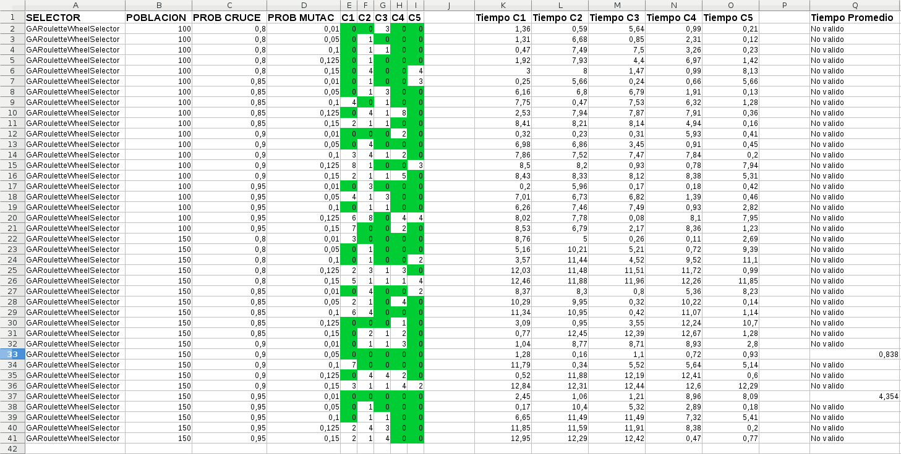
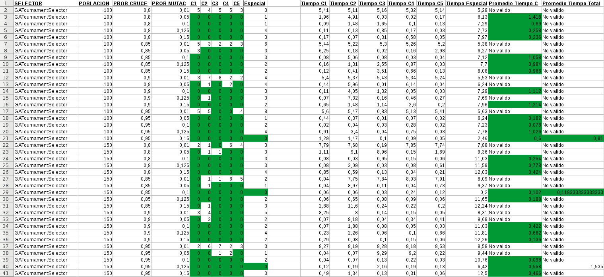

---
title: Sistemas Inteligentes
subtitle: Practica 1
author:
    - Pablo José Rocamora Zamora G3.2
date: 9 de Diciembre de 2017
header: dsad
footer: So is this
geometry: margin=1in
toc: true
toc-depth: 1
fontsize: 11pt # puede ser 10, 11 o 12
fontfamily: lmodern
documentclass: scrartcl
header-includes:
    - \usepackage{xcolor}
    - \definecolor{miverde}{rgb}{0.31,0.60,0.02}
    - \definecolor{migris}{rgb}{0.56,0.35,0.01}
    - \definecolor{mimazul}{rgb}{0.13,0.29,0.53}
    - \lstset{basicstyle=\small\ttfamily} # Fija el tamaño del tipo de letra utilizado para el código
    - \lstset{breaklines=true} # Activa el salto de línea automático
    - \lstset{extendedchars=true} # Permite utilizar caracteres extendidos no-ASCII; solo funciona para codificaciones de 8-bits; para UTF-8 no funciona. En xelatex necesita estar a true para que funcione.
    - \lstset{tabsize=2} # Establece el salto de las tabulaciones a 2 espacios
    - \lstset{columns=fixed}
    - \lstset{showstringspaces=false} # subraya solamente los espacios que estén en una cadena de esto
    - \lstset{frame=trbl} # Añade un marco al código
    - \lstset{frameround=tttt}
    - \lstset{framesep=4pt}
    - \lstset{numbers=left} # Posición de los números de línea (none, left, right).
    - \lstset{numberstyle=\tiny\ttfamily} # Estilo para los números de línea
    - \lstset{postbreak=\raisebox{0ex}[0ex][0ex]{\ensuremath{\color{red}\hookrightarrow\space}}}
    - \lstset{keywordstyle=\color{mimazul}} # estilo de las palabras clave
    - \lstset{stringstyle=\color{miverde}} # Estilo de las cadenas de texto
    - \lstset{commentstyle=\color{migris}} # Estilo de los comentarios
    - \lstset{stepnumber=2} # Muestra solamente los números de línea que corresponden a cada salto. Va de 2 en 2. En este caso: 1,3,5,...
    - \lstset{numbersep=5pt} # Distancia de los números de línea al código
    - \lstset{backgroundcolor=\color[RGB]{248,248,248}} # Indica el color de fondo; necesita que se añada \usepackage{color} o \usepackage{xcolor}
    - \lstset{showspaces=false} # Si se activa, muestra los espacios con guiones bajos; sustituye a 'showstringspaces'
    - \lstset{showtabs=false} # muestra las tabulaciones que existan en cadenas de texto con guión bajo
    - \lstset{captionpos=b} # Establece la posición de la leyenda del cuadro de código
    - \lstset{breakatwhitespace=false} # esto hace que sea una linea son contar
    - \lstset{breakautoindent=true} # Activarlo para que los saltos automáticos solo se apliquen en los espacios en blanco
    - \lstset{escapeinside={\%*}{*)}} # Si quieres incorporar LaTeX dentro del propio código
    - \lstset{linewidth=\textwidth}
    - \lstset{basewidth=0.5em}
    - \lstset{language=C} # Establece el lenguaje por defecto. Se puede cambiar para cada bloque de código insertado
    - \lstset{otherkeywords={}} # Si se quieren añadir otras palabras clave al lenguaje
--- 

# a) Explicación breve y completa de la técnica Algoritmo Genético (AG). Debe quedarse muy claro cuáles son los elementos y el proceso que sigue dicha técnica.

Un algoritmo genético (AG) es una variante de la búsqueda de haz estocástica en el que los estados sucesores se generan combinando a dos estados padres, más que modificar un solo estado.

El algoritmo genético trata de encontrar la mejor solución por comparación de un conjunto de soluciones. 

Las soluciones se generan a través del cruzamiento de generaciones o soluciones anteriores, esta cruzando generaciones para obtener una nueva generación de manera que podamos compararla para ver si estamos acercándonos a la solución final

## Elementos

#### Tenemos diferentes formas de codificar una población:

- Codificación binaria
- Codificación entera
- Codificación real
- Codificación en orden

#### Tenemos distintos operadores genéticos:

- Selección (escoge que individuos se reproducirán y cuales no)
    - **Ruleta**: Se eligen con probabilidad proporcional a su función de idoneidad.
    - **Torneo**: Se establecen k torneos aleatorios entre parejas de individuos y se eligen los que ganan en cada torneo (mejor función idoneidad).

- Cruce (recombina individuos para producir descendencia)
    - **Cruce por un punto**: Un padre ha partir de un gen intercambio el resto por el de otro padre
    - **Cruce por dos puntos**: Un padre intercambio un rango de genes por el de otro padre

- Mutación (provoca el cambio de valor de algunos genes del individuo)
    - **Cambio de un gen aleatorio**
    - **Intercambio entre dos genes**

#### Tenemos que definir la función objetivo

Es necesario crear la función fitness, es una función de adaptación que tiene que retornar: *>0*, es la forma de evaluar la población.

## Proceso

1. Codificamos el problema, en nuestro caso en forma de *Integer*
2. Generanos una población inicial aleatoriamente de k estados  
3. Seleccionamos k individuos a través del operador de selección para crear una nueva población.
4. Elegimos individuos con una probabilidad (p~c~) para ser cruzados y crear una nueva población.
5. Con una probabilidad (p~m~) mutamos los genes de los individuos de la población actual.
6. Esta nueva población sustituye a la original y forma la nueva población inicial que se usara en la siguiente generación, volvemos al paso 3

# b) Explicación detallada de todas las preguntas realizadas en la sección “Cuestiones para el diseño e implementación” de este guión (en concreto, las preguntas 3), 4), 7), 9), 10) y 12)).

## 3) Dada esa definición, explica de qué manera se están inicializando los individuos en el AG propuesto.

## 4) Explica el funcionamiento de los operadores de selección indicados en la sección “Ajuste del Algoritmo Genético”.

## 7) Dada esa definición, explica de qué manera se están cruzando los individuos.

## 9) Dada esa definición, explica de qué manera se están mutando los individuos.

## 10) Define y explica la condición de parada que utilizarás.

## 12) Diseña y explica la función fitness que utilizarás. Recuerda, como se indica al comienzo de este guión, que una solución del sudoku no puede repetir en una misma fila, columna o subcuadrícula ninguno de los números

\newpage

# c) La tabla completa que muestre los valores de la función fitness para todas las pruebas realizadas para el ajuste del software sobre los distintos valores para los parámetros ajustables y para los distintos “Casos para el Ajuste” propuestos. La tabla debe mostrarse de forma clara y que facilite su análisis. Ver sección “Ajuste del Algoritmo Genético” en este mismo documento.

a) se eligen los distintos métodos aplicables y un conjunto de posibles valores para los parámetros, 
b) se selecciona un conjunto significativo de casos del problema, 
c) se resuelven todos los casos utilizando todas las combinaciones de métodos-valores, 
d) se analizan las soluciones. 
A partir de esto, debemos obtener unos determinados métodos y valores que hacen al algoritmo robusto, eficiente y óptimo (o lo mejor posible).

\newpage

# d) Análisis de las pruebas de ajuste (esto es, el análisis de la tabla de resultados del apartado c). El objetivo de este análisis es obtener el comportamiento del software diseñado.

# e) A partir de este análisis, indicar qué valores de los parámetros debemos utilizar, y el protocolo para asignarlos, para que el software tenga un comportamiento aceptable. Denominar a esta sección “manual-Asignación”.

# f) Para cada uno de los “Casos del Usuario” (ver sección correspondiente), indicar el protocolo seguido para resolverlo (siguiendo el “manual-Asignación”), el valor para cada parámetro, la solución obtenida y su fitness.

This is a test [@doe1905].

# Bibliografía 